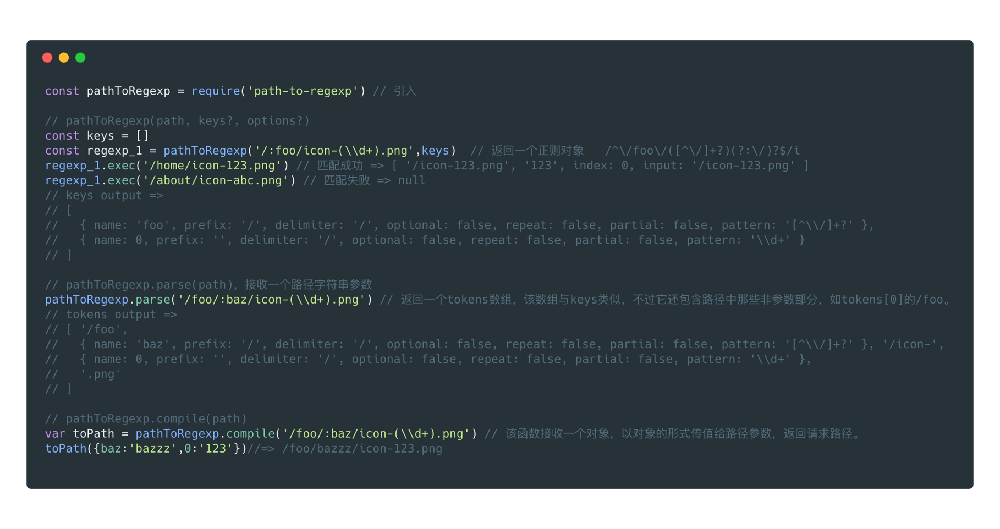
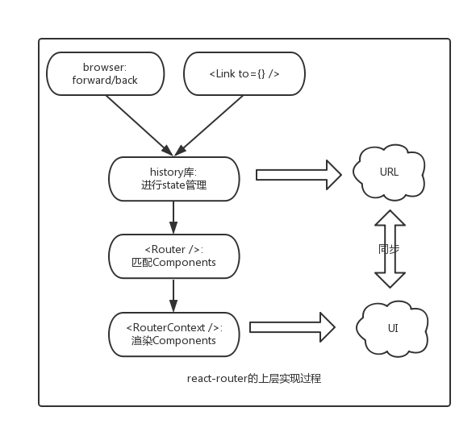

## React-router Ver 4.3
在单页面应用最重要的就是路由，本文就简单的解读下react框架下最流行的路由模块react-router,由于react-rotuer每次版本更新变化较大，故本文只从react-router4.3 入手

概要:react-router是对history历史状态库的封装，使UI和URL进行同步，本文只是对具体实现的一个分析，的一些用法不再赘述

### history
- 老浏览器的history: 主要通过hash来实现，对应`createHashHistory`

- 高版本浏览器: 通过html5里面的history，对应`createBrowserHistory`

- node环境下: 主要存储在memeory里面，对应`createMemoryHistory`

上面针对不同的环境提供了三个API，但是三个API有一些共性的操作，将其抽象了一个公共的文件createHistory:
```
// 内部的抽象实现
function createHistory(options={}) {
  ...
  return {
    listenBefore, // 内部的hook机制，可以在location发生变化前执行某些行为，AOP的实现
    listen, // location发生改变时触发回调
    transitionTo, // 执行location的改变
    push, // 改变location
    replace,
    go,
    goBack,
    goForward,
    createKey, // 创建location的key，用于唯一标示该location，是随机生成的
    createPath,
    createHref,
    createLocation, // 创建location
  }
}
```

上述这些方式是history内部最基础的方法，createHashHistory、createBrowserHistory、createMemoryHistory只是覆盖其中的某些方法而已。其中需要注意的是，此时的location跟浏览器原生的location是不相同的，最大的区别就在于里面多了key字段，history内部通过key来进行location的操作。

```
function createLocation() {
  return {
    pathname, // url的基本路径
    search, // 查询字段
    hash, // url中的hash值
    state, // url对应的state字段
    action, // 分为 push、replace、pop三种
    key // 生成方法为: Math.random().toString(36).substr(2, length)
  }
}
```

### path-to-regexp
在react-router4中用于将路径转化为正则， 再通过exec方法匹配路径


### react-router 结构
```
+ -- react-router
+ -- react-router-config 
+ -- react-router-dom
+ -- react-router-native 
+ -- react-router-redux
```
一般使用只需引入`react-router-dom`即可，因为`react-router-dom`内部依赖了`react-router`
如果使用了redux则再引入 `react-router-redux`
如果是native应用，则再引入`react-router-redux`
`react-router-config`是简化了路由的配置，拆分路由，统一引入，利于多人合作

### 基本原理

### 目录
 - 01 [Router](./chapters/Router.js)
 - 02 [Route](./chapters/Route.js)
 - 03 [Switch](./chapters/Switch.js)
 - 04 [matchPath](./chapters/matchPath.js)
 - 05 [Link](./chapters/Link.js)
 - 06 [Redirect](./chapters/Redirect.js)
 - 07 [HashRouter](./chapters/HashRouter.js)
 - 08 [BrowserRouter](./chapters/BrowserRouter.js)
 - 09 [generatePath](./chapters/generatePath.js)


